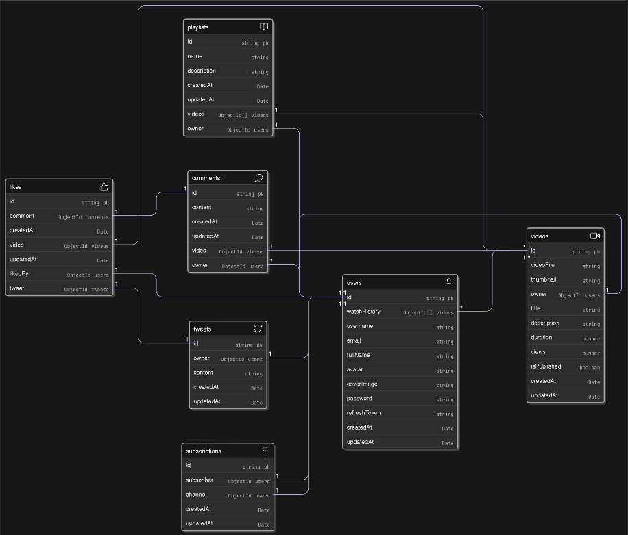

# 🎥 Vidio API

A scalable, production-ready backend for a YouTube-like video streaming and community platform. Vidio powers user authentication, video uploads, playlists, social interactions, and creator subscriptions with a clean, modular architecture.


---

## Entity Relationship Diagram



## 🚀 Features

### 👤 Authentication & Users
- User registration and login with JWT authentication
- Secure password hashing
- User profile & channel management
- Watch history tracking

### 🎬 Video Management
- Video upload with cloud storage support
- Publish / unpublish videos
- View count tracking
- Fetch single video, user videos, and feed

### 💬 Engagement System
- Comment on videos (add, edit, delete)
- Polymorphic likes system (videos, comments, tweets)
- Real-time like & comment counts

### 📂 Playlists
- Create and manage playlists
- Add or remove videos from playlists
- Fetch user playlists

### 🐦 Tweets (Community Posts)
- Create and delete tweets
- Like tweets
- Fetch tweets by user

### 🔔 Subscriptions
- Subscribe / unsubscribe to channels
- Track subscriber counts
- Fetch channel subscribers

### 🔍 Search & Discovery
- Search videos by title
- Search channels by username
- Indexed queries for fast performance

---

## 🧱 Tech Stack

- **Backend:** Node.js, Express.js
- **Database:** MongoDB, Mongoose
- **Authentication:** JWT (Access & Refresh Tokens)
- **Media Storage:** Cloudinary / AWS S3


---

## 📁 Project Structure

```
src/
 ├─ controllers/
 ├─ models/
 ├─ routes/
 ├─ middlewares/
 ├─ services/
 ├─ utils/
 └─ index.js
```

---

## 🔁 End-to-End Flow

- User signs up and logs in
- User uploads and publishes a video
- Other users watch, like, and comment on the video
- User adds the video to a playlist
- User posts a tweet (community update)
- Other users like the tweet and subscribe to the user’s channel

---


## ▶️ Getting Started

```bash
# Install dependencies
npm install

# Start development server
npm run dev
```

Server will start at:
```
http://localhost:5000
```

---

## 📘 API Documentation

- API endpoints documented using **Postman / Swagger**
- Includes authentication, video, playlist, likes, comments, tweets, and subscriptions


---

## 🌱 Future Enhancements

- Video recommendations engine
- Notifications system
- Live streaming support
- Admin dashboard
- Role-based access control

---

## 👨‍💻 Author

**Sarvesh Gaynar**  
Software Engineer | JavaScript | React | Node.js

> _Just an average human who loves to code._

---

## ⭐ Why This Project

StreamHive API demonstrates real-world backend engineering skills including scalable architecture, secure authentication, complex entity relationships, and social engagement systems — making it a strong portfolio project for backend and full-stack roles.

